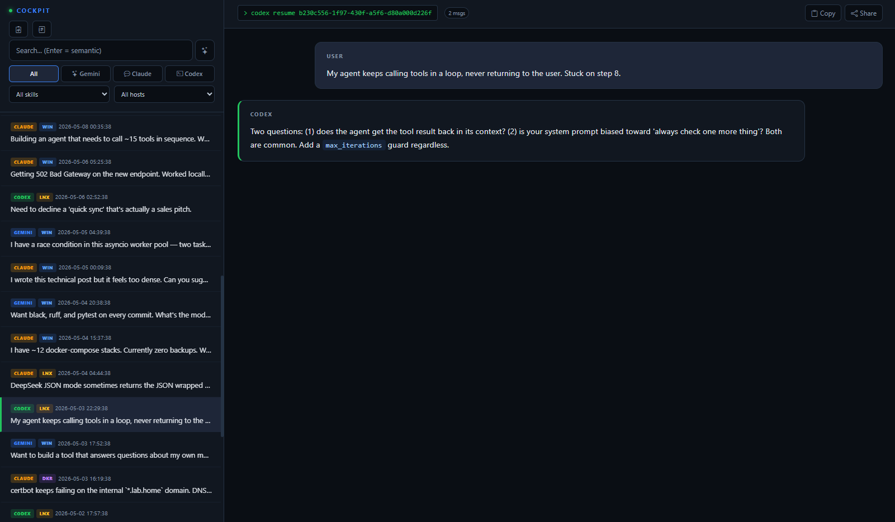
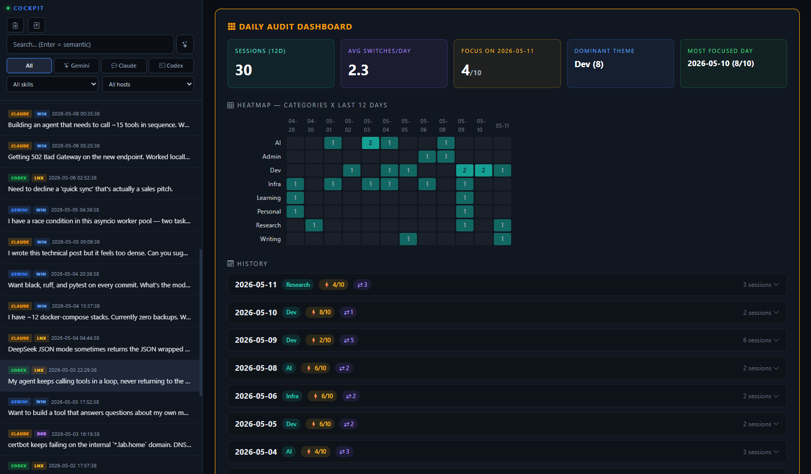
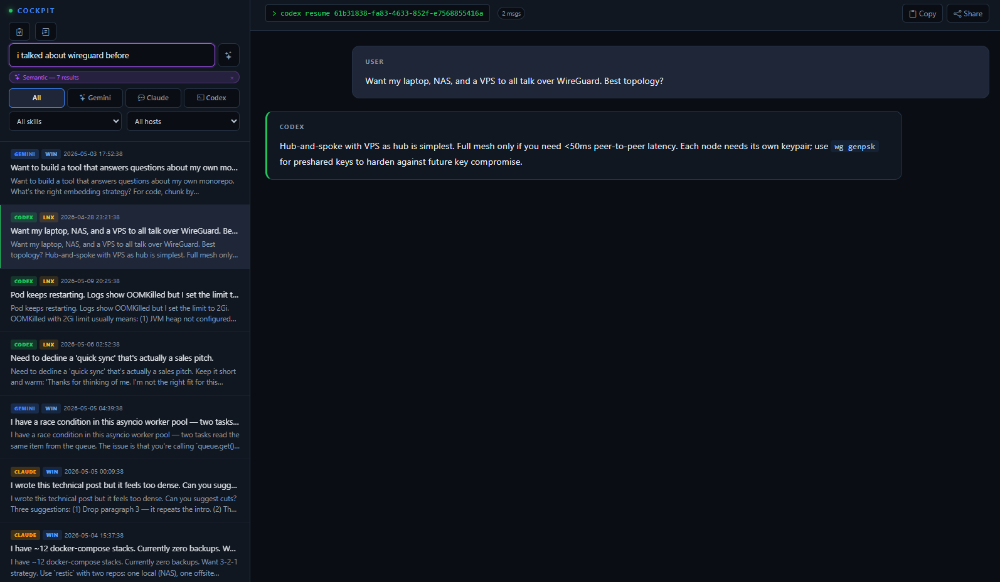
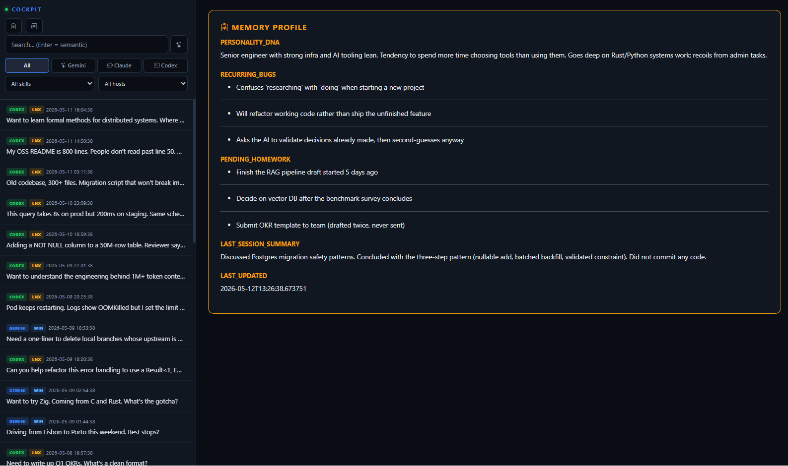

# Cockpit — Forensic UI for AI Chat Sessions


Self-hosted forensic UI that indexes [Claude Code](https://docs.claude.com/en/docs/claude-code), [Codex CLI](https://github.com/openai/codex), and [Gemini CLI](https://github.com/google-gemini/gemini-cli) sessions across every machine you use. Hybrid search (BM25 + embeddings), daily LLM-generated audits with behavioral patterns, and a memory profile distilled from recurring themes — all in one dashboard you control.



## Why

CLI assistants scatter `.jsonl` files across `~/.claude/`, `~/.codex/`, `~/.gemini/` on every machine. There's no global search, no recall, no "what did I work on last Thursday" view. Cockpit fixes that.

## Features

| Feature | Description |
|---------|-------------|
| **Hybrid Search** | Chunk-level BM25 (accent-insensitive) + optional Gemini embeddings, fused via Reciprocal Rank Fusion, with optional LLM reranking |
| **Daily Audit** | LLM-generated structured JSON: headline, narrative, behavioral patterns, focus score |
| **Weekly Digest** | Cross-cutting analysis over the last 7 daily audits |
| **Memory Profile** | Long-term distillation of recurring themes, blockers, and open threads |
| **Category Heatmap** | Visual breakdown of session topics across the last 14 days |
| **Per-source Badges** | Color-coded sessions by AI (Claude/Gemini/Codex) and host (WIN/LNX/DKR) |
| **Custom Voice** | Opinionated auditor persona for the daily/weekly summaries — fully swappable in the prompt |

## Screenshots

| Daily Audit Dashboard | Semantic Search |
|:---:|:---:|
|  |  |

| Memory Profile | |
|:---:|:---:|
|  | |

## Architecture

```
[ client machines ]               [ cockpit server ]
                                  +---------------------+
~/.claude/projects/  ----rsync-->  | data/claude/        |
~/.codex/sessions/   ----cron --->  | data/codex/         |  --> cockpit.py
~/.gemini/tmp/...    ----rsync-->  | data/gemini/        |        |
                                  |                     |        +-- index worker (BM25)
                                  | daily_audit.json    | <------+   every 150s
                                  | search_index.json   |        |
                                  | memory_profile.json |        +-- /api/search
                                  +---------------------+        +-- /api/memory/*
                                                                 +-- web UI :8000
```

Sync is push-based: each client cron-rsyncs its session directory to the server. The server only reads — it never SSHes back out.

## Structure

```
cockpit/
├── app/
│   ├── cockpit.py              # HTTP server + index worker + UI
│   ├── daily_auditor.py        # Daily LLM audit pipeline
│   ├── weekly_digest.py        # 7-day pattern analysis
│   └── memory_distiller.py     # Long-term profile builder
├── scripts/
│   ├── sync/                   # rsync scripts for each client
│   │   ├── claude_sync.sh
│   │   ├── codex_sync.sh
│   │   └── gemini_sync.sh
│   └── demo/
│       └── seed-data.py        # Generates fake data for demos/screenshots
├── docs/
│   ├── ARCHITECTURE.md
│   ├── CONFIGURATION.md
│   └── screenshots/
├── docker-compose.yml
├── Dockerfile
└── requirements.txt
```

## Quick Start

### 1. Run the server

```bash
git clone <repo-url> cockpit
cd cockpit
cp .env.example .env
# Edit .env — set at least one of DEEPSEEK_API_KEY or GEMINI_API_KEY
docker compose up -d
```

Open `http://localhost:8000`. UI will be empty until sessions arrive.

### 2. Try it with fake data

```bash
python scripts/demo/seed-data.py
docker compose restart cockpit
```

30 fictional sessions + 12-day audit history populate the UI. Useful for screenshots, demos, or evaluating before wiring up real syncs.

### 3. Sync from your machines

On each machine where you use Claude / Codex / Gemini CLIs:

```bash
cd scripts/sync
cp .env.example .env
# Edit .env — set COCKPIT_HOST / COCKPIT_USER / CLIENT_NAME
ssh-copy-id $COCKPIT_USER@$COCKPIT_HOST
crontab -e
```

Add the scripts you need (skip the ones you don't use):

```cron
*/5 * * * * /path/to/cockpit/scripts/sync/claude_sync.sh
*/5 * * * * /path/to/cockpit/scripts/sync/codex_sync.sh
*/5 * * * * /path/to/cockpit/scripts/sync/gemini_sync.sh
```

Sessions appear in the UI within ~3 minutes.

## Configuration

All config via env vars. See [`docs/CONFIGURATION.md`](docs/CONFIGURATION.md) for the full reference.

| Variable | Default | Purpose |
|----------|---------|---------|
| `PORT` | `8000` | HTTP listen port |
| `DEEPSEEK_API_KEY` | — | Primary LLM for audits (cheap, JSON-mode reliable) |
| `GEMINI_API_KEY` | — | Fallback LLM + embeddings for semantic search |
| `OPENAI_API_KEY` | — | Optional: enables LLM reranking of search results |
| `RERANK_MODEL` | `gpt-4o-mini` | OpenAI model used for reranking |
| `RERANK_TOP` | `30` | How many top candidates to rerank per query |
| `TZ` | `UTC` | Affects daily audit date boundaries |
| `MEMORY_KEYWORDS` | (empty) | Comma-separated filter for the memory distiller |

At least one of `DEEPSEEK_API_KEY` / `GEMINI_API_KEY` is required. Without `GEMINI_API_KEY`, semantic search degrades to BM25-only — still very usable. Reranking is fully optional: without `OPENAI_API_KEY` the search returns the RRF-fused order unchanged.

## API

| Endpoint | Method | Description |
|----------|--------|-------------|
| `/` | GET | Web UI |
| `/api/chats` | GET | All indexed sessions (metadata) |
| `/api/chat/<uid>` | GET | Full messages of one session |
| `/api/search` | POST | Hybrid BM25 + semantic search. Body: `{"query": "..."}` |
| `/api/search/status` | GET | Index health |
| `/api/memory/daily` | GET | Rolling 14-day audit history |
| `/api/memory/weekly` | GET | On-demand weekly digest (regenerates per call) |
| `/api/memory/profile` | GET | Long-term distilled memory |
| `/api/skill_log` | POST | Tag the next session with a skill |

## Stack

- **Python 3.11** stdlib HTTP server (no Flask/FastAPI dependency)
- **rank-bm25** + **numpy** for chunk-level keyword search
- **Google Gemini** embeddings (optional) for semantic search
- **OpenAI** (optional) for LLM reranking of search results
- **DeepSeek** (primary) + **Gemini** (fallback) for daily audits and memory distillation
- **Docker Compose** deployment
- **Bash + rsync** for client-side syncing (no agent on clients)

## Customizing the Persona

The auditor and distillers ship with a strong default voice. To change it:

1. Open `app/daily_auditor.py` (or `weekly_digest.py` / `memory_distiller.py`)
2. Find the `prompt_text = (...)` block
3. Replace the TONE RULES section. Keep the JSON FORMAT block intact — the UI parses it.

A neutral replacement is suggested in [`docs/CONFIGURATION.md`](docs/CONFIGURATION.md).

## Limitations

- **No auth.** UI is open on whatever port you bind. Put behind a reverse proxy + basic auth if exposed beyond LAN.
- **Single tenant.** Sessions from all clients land in the same index.
- **LLM cost.** ~1 audit + ~1 weekly digest + ~1 embedding per new chat per day. With DeepSeek as primary, stays well under USD $1/month for typical use.
- **Codex parser is best-effort.** Codex JSONL format has shifted occasionally; the parser may need updates if the format changes.

## License

MIT — see [`LICENSE`](LICENSE).
